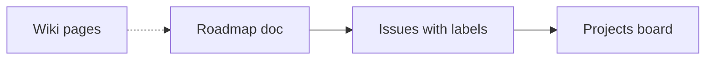

# Roadmap · 路线图

**中文：** 本文件是 OpenSkill 的**公开产品方向**（愿景、阶段、优先级），与 [GitHub Projects](https://github.com/OpenAgenticOS/OpenSkill/projects) 上的执行看板、[Wiki](https://github.com/OpenAgenticOS/OpenSkill/wiki) 上的说明页**配套使用**：这里写「要去哪里」，Projects 写「谁在做什么」，Wiki 写「怎么用、常见问答」。

**English:** This file is the **public direction** for OpenSkill (vision, phases, priorities). Use it together with the [GitHub Projects](https://github.com/OpenAgenticOS/OpenSkill/projects) board and the [Wiki](https://github.com/OpenAgenticOS/OpenSkill/wiki): the roadmap states **where we’re going**, Projects track **who is doing what**, and the Wiki explains **how to use the repo and FAQs**.

**维护者须知 · Maintainer note:** 在组织或仓库中新建 Project 后，把看板链接补到 [docs/GITHUB_PROJECTS_AND_WIKI.md](./GITHUB_PROJECTS_AND_WIKI.md)。After creating a project, add its URL there.

---

## 愿景 · Vision（2026）

| 维度 · Dimension | 中文 | English |
|------------------|------|---------|
| **定位** | 企业场景下**可复用、可评审、双语**的大模型技能库，覆盖从高管到一线的关键岗位原子任务。 | An enterprise-focused library of **reusable, reviewable, bilingual** LLM skills covering atomic tasks from leadership to IC roles. |
| **成功样子** | 贡献者能用 Issue/PR 模板在 15 分钟内提交技能；CI 自动校验；维护者用 Project 管理优先级；新用户能在 Wiki 5 分钟内上手。 | Contributors can land a skill in ~15 minutes via templates; CI validates; maintainers prioritize via Projects; new users onboard from the Wiki in ~5 minutes. |
| **非目标** | 不做封闭商业产品、不做单一模型绑定、不要求一次覆盖所有行业变体。 | Not a closed commercial product, not tied to one model, not exhaustive for every industry variant. |

---

## 三列时间视角 · Now / Next / Later

**中文：** 下列时间为**大致季度**，以社区节奏为准，会在本文件顶部的 Maintainer note 或 Discussions 中同步调整。

**English:** Quarters are **indicative**; we’ll adjust via maintainer notes or Discussions.

### Now（当前聚焦 · Current）

| 主题 · Theme | 交付物 · Outcomes | 参与方式 · How to help |
|--------------|-------------------|------------------------|
| **技能覆盖 · Skill coverage** | 补齐 README 已列出但尚无 `.skill.md` 的目录（如部分 `management/*`、`individual-contributor/*`）。 | [New Skill](https://github.com/OpenAgenticOS/OpenSkill/issues/new?template=new_skill.yml) 或直接 PR。 |
| **质量底线 · Quality bar** | 为缺少「输出示例」的存量技能补示例（见 CI 警告）。 | [Skill Improvement](https://github.com/OpenAgenticOS/OpenSkill/issues/new?template=skill_improvement.yml) |
| **可发现性 · Discoverability** | 保持 `docs/SKILL_INDEX.md` 与 `npm run build-index` 一致；README 目录表与真实文件同步。 | 文档 PR、`documentation` 类 Issue |

### Next（下一波 · Next）

| 主题 · Theme | 交付物 · Outcomes | 参与方式 · How to help |
|--------------|-------------------|------------------------|
| **跨职能包 · Cross-functional packs** | 会议纪要与行动项、邮件升级、数据叙事等「高频办公」技能成组发布说明。 | Issue 讨论分组命名与目录结构 |
| **工具链 · Tooling** | 校验器更易用（单文件错误信息、可选规则级别）；评估是否提供轻量 CLI（仅讨论，未承诺 npm 发布）。 | [Tooling & CI](https://github.com/OpenAgenticOS/OpenSkill/issues/new?template=tooling_ci.yml) |
| **Wiki 与入门 · Wiki & onboarding** | Wiki 首页、贡献流程一页图、与 `CONTRIBUTING.md` 互链。 | Wiki 编辑权限由维护者授予；也可先 PR 到 `docs/` |

### Later（后续储备 · Later）

| 主题 · Theme | 说明 · Notes |
|--------------|--------------|
| **Schema 演进 · Schema evolution** | 在保持向后兼容前提下扩展 frontmatter（如 `evaluations` 结构化字段）；需 RFC Issue。 |
| **生态集成 · Ecosystem** | 与 Agent 框架、MCP 的示例对齐（文档级为主）。 |
| **多语言扩展 · More languages** | 在双语（中/英）稳定后，评估第三语言社区维护模式。 |

---

## 与 GitHub Projects 的对应关系 · Mapping to Projects

**中文：** 建议维护者使用 **Project 字段**（或自定义字段）与下表一致，便于贡献者筛选：

**English:** Maintainers: align **project fields** (or custom fields) with this table so contributors can filter work.

| 建议字段 · Suggested field | 取值示例 · Example values | 对应路线图 · Maps to |
|----------------------------|---------------------------|----------------------|
| **Status** | Backlog / Ready / In progress / Done | 执行状态 |
| **Priority** | P0 / P1 / P2 | Now ≈ P0，Next ≈ P1，Later ≈ P2 |
| **Area** | skills / tooling / docs / governance | 与 labeler 标签一致 |
| **Track** | coverage / quality / discoverability / wiki | 上表「主题」 |

将具体任务拆成 **Issue**（或子 Issue），再拖入 Project；路线图**不**替代 Issue 讨论，只定方向。

---

## 与 Wiki 的分工 · Wiki split

| 内容放 Wiki · Put on Wiki | 内容放仓库 `docs/` · Keep in repo |
|---------------------------|-------------------------------------|
| 新贡献者「第一步」截图流、常见问题 | 需版本审查的规范（本 ROADMAP、GOVERNANCE、BRANCH_PROTECTION） |
| 各岗位「推荐先试哪几个 Skill」清单 | Schema、校验脚本、CI 说明 |
| 会议记录摘要（可选） | 法律与合规文本（LICENSE、CODE_OF_CONDUCT、SECURITY） |

详细搭建步骤见 [GITHUB_PROJECTS_AND_WIKI.md](./GITHUB_PROJECTS_AND_WIKI.md)。

---

## 修订记录 · Changelog

| 日期 · Date | 变更 · Change |
|-------------|---------------|
| 2026-04-05 | 首版公开路线图 · Initial public roadmap |
